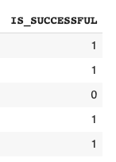
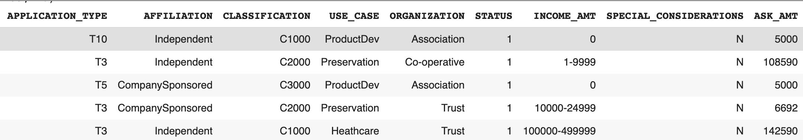
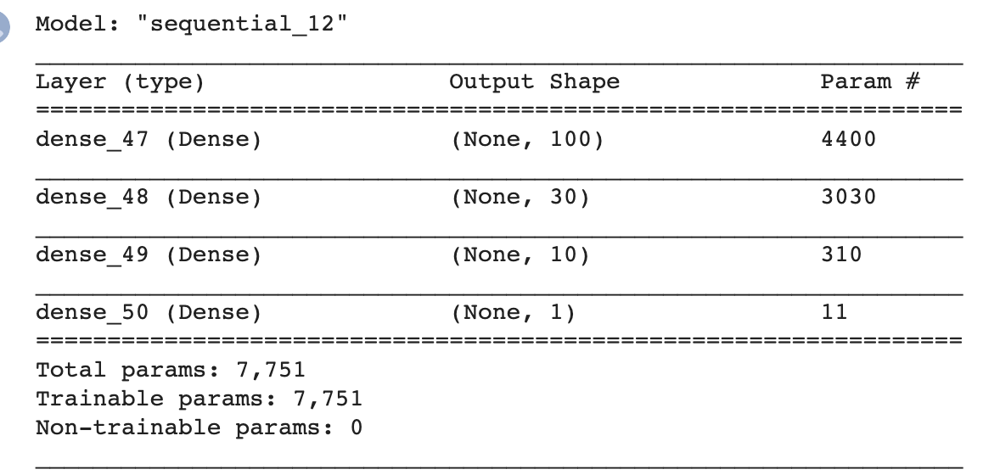
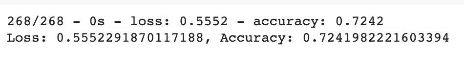

# Neural_Network_Charity_Analysis
Analysis of charity data via machine learning and artificial neural networks

## Overview

Alphabaet soup is a non-profit organization that aims to help people improve their well-being and protect the environment. It raises money to donate to oganizations and people in need to help them succeed. However, some organizations just receive the money and dissappear. Hence, to ensure that the donations are impactful and are used effectively Beck is asked to design a mathematical data driven model which would help dtermine which recepients are worth donating to and which are high-risk. Becks designs a deep-neural network model to investigate potential successful recepients.

## Results

* The target variable in this analysis is the "IS_SUCCESSFUL" variable.

* The featuress in this analysis are "APPLICATION_TYPE", "AFFILIATION", "CLASSIFICATION", "USE_CASE", "ORGANIZATION", "STATUS", "INCOME_AMT", "SPECIAL_CONSIDERATIONS",  and "ASK_AMT".

* The "EIN and "NAME" are the identification columns and are redundant for our analysis. Hence, they are dropped from the dataframe.

* Our final model has three hidden layers and an output layer.
* First hidden layer has 100 neurons, second layer has 30, and the third layer has 10 neurons.
* The activation function used for the hidden layers is the "RELU" function and for the output layer it is the "sigmoid" function.

* With these specifications we were not able to achieve the target model performance of greater than 75%. Our model's accuracy was at 72 %.

* To optimize the model several attemps were made. We increased the number of hidden layers to 3 and also to 4, tried running the model with tanh activation function instead of relu for the hidden layers. We kept the output layer's activation function as sigmoid benacuse our output is a binary variable and sigmoid is the most suitable function for this.
* We increased and also decreased the number of epochs to investigate if the performance of the model will increae.
* However, the performance of the model barely changed with these attempts. None of the attempts produced a significantly greater performance. Hence, we kept the final model as our optimized model. 

## Summary

A deep neural network model with three hidden layers is designed to investigate which potential recepients are high- risk and which are worth donating to. The accuracy of our model reached only 72% which indicates that 72% of the time our model will be able to predict successful candidates correctly. To optimize our deep learning model we tried different activation functions, number of neurons, number of layers and number of epochs. Unfortunately, we were not able to significanty increase the performance of our model. However, we have not tried to alter the inpur data by dropping columns or changing the binning of the categorical variables. One of these options could potentially reduce the noise in our data and help increase the performance of our deep learning model.

